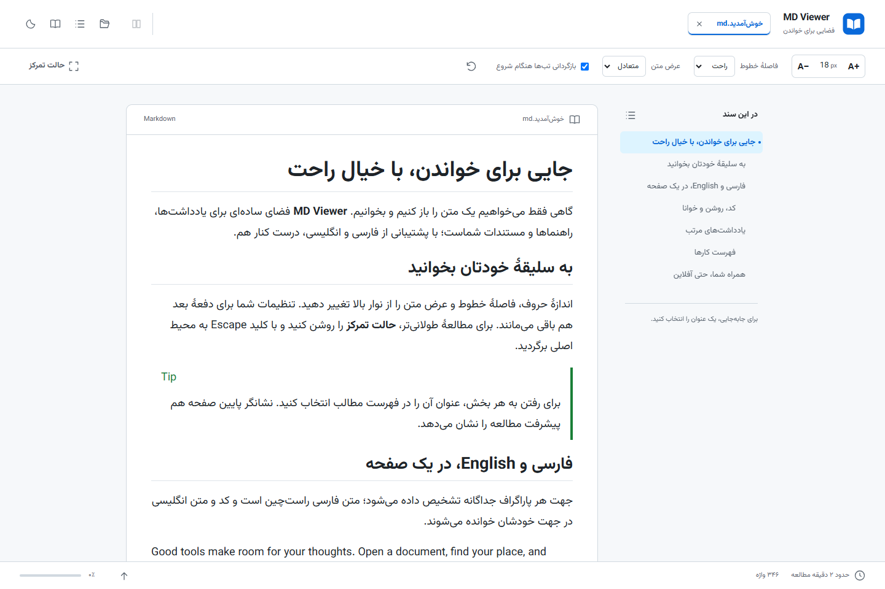
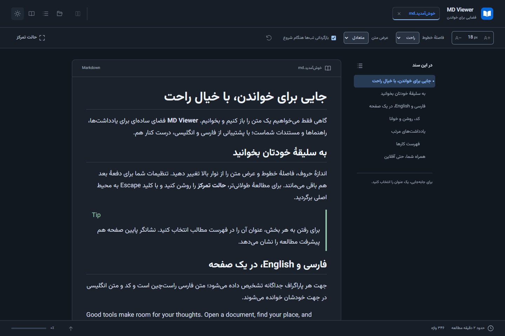
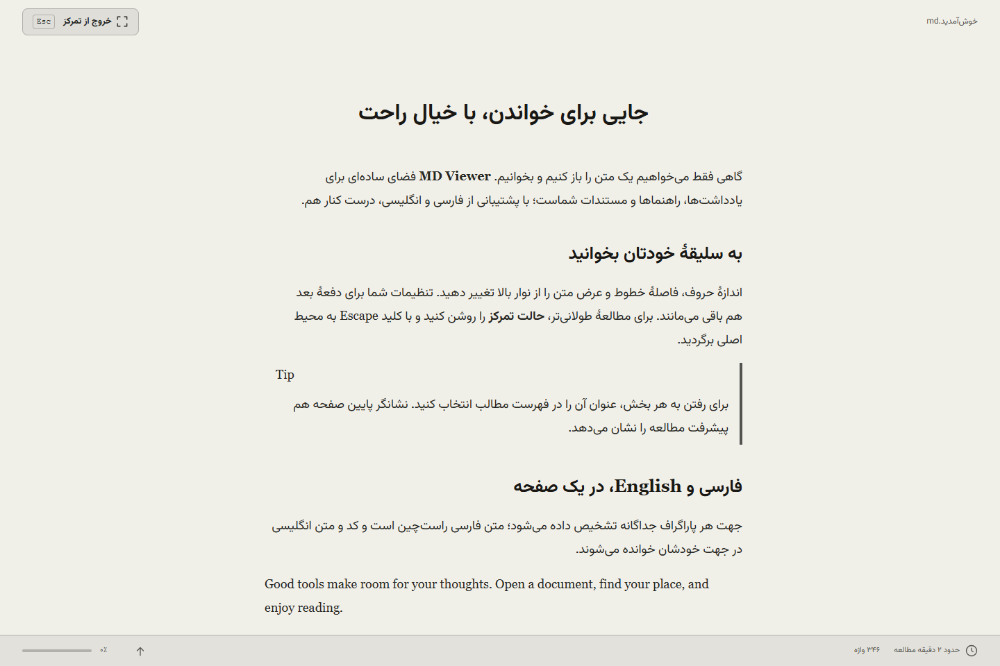

# MD Viewer

MD Viewer is a private, GitHub-style Markdown reader for Windows and the web. Built with Electron, React, and TypeScript, it provides a focused way to read local documentation online or offline.

## Highlights

- Open local Markdown documents in a clean, responsive workspace.
- Keep multiple documents in tabs and restore the desktop workspace between sessions.
- Compare documents side by side on wider screens; the layout adapts for smaller windows.
- Adjust font size, line height, reading width, and light or dark themes.
- Track reading progress, word count, and estimated reading time in focus mode.
- Use E-Ink mode for a calm, high-contrast reading experience.
- Render GitHub Flavored Markdown, syntax-highlighted code, tables, task lists, footnotes, math, admonitions, and Mermaid diagrams.
- Read right-to-left documents with direction-aware layout and typography.
- Navigate long documents with an h1–h3 table of contents.
- Open `.md` and `.txt` files in the web app, including documents up to 5 MB.

## Screenshots

<p align="center">
  
</p>

**Light theme** — a streamlined reading workspace with compact header controls.

<p align="center">
  
</p>

**Dark theme** — a high-contrast version of the same compact workspace for low-light reading.

<p align="center">
  
</p>

**Focus and E-Ink mode** — distraction-free reading with progress, word count, and estimated reading time.

## Privacy and Security

Your documents stay under your control.

- The desktop app opens files from your computer; it does not upload document contents to a service.
- The web app uses the browser's file picker and keeps its workspace in browser storage for offline use.
- Desktop image loading is restricted to files inside the opened document's folder. Path traversal and symlink escapes are rejected.
- Web browsers cannot read arbitrary local relative images, so those images are unavailable in the web app.
- Remote images use their original HTTP(S) hosts and are not cached for offline use.
- Markdown is sanitized before rendering. Scripts, iframes, forms, `javascript:` URLs, and local-file links are blocked; safe HTTP(S), `mailto:`, and in-document links remain available.
- The Electron app uses sandboxing, context isolation, disabled Node integration, and a restrictive Content Security Policy.

## Quick Start

### Desktop app

```bash
npm ci
npm run electron:dev
```

The development desktop app opens automatically. Use the file picker to open a Markdown document.

### Web app

```bash
npm ci
npm run build:web
npm run preview
```

Open the preview address shown in the terminal, then select a local `.md` or `.txt` file.

## Using MD Viewer

### Desktop

Open Markdown documents with the file picker. Supported extensions are `.md`, `.markdown`, `.mdown`, and `.mkd`. Documents open in tabs, and the app restores your workspace when you return.

On screens wider than 960 pixels, open a second tab alongside the first to compare two documents. Use the reading controls to adjust the type scale, line height, content width, color theme, focus mode, and E-Ink mode.

### Web

Choose a `.md` or `.txt` file from your browser. The web version supports files up to 5 MB and stores the current workspace locally in the browser, so it remains useful offline after the initial load.

Because browsers protect your local filesystem, relative images stored next to a Markdown file are available in the desktop app but not in the web app.

## Development

Install dependencies once:

```bash
npm ci
```

| Command                  | Purpose                                             |
| ------------------------ | --------------------------------------------------- |
| `npm run dev`            | Start the web development server.                   |
| `npm run electron:dev`   | Start the Electron development app.                 |
| `npm run build:web`      | Build the web app for production.                   |
| `npm run build:electron` | Build Electron main and preload bundles.            |
| `npm run electron:build` | Create the Windows installer.                       |
| `npm run generate:icons` | Regenerate application icons from the source asset. |

## Quality Checks

Run the full static-quality suite before contributing or publishing a release:

```bash
npm run check
```

For browser end-to-end tests, build the web app first:

```bash
npm run build:web
npm run test:e2e
```

## Build a Windows Installer

Create the distributable Windows installer with:

```bash
npm run electron:build
```

The generated installer and blockmap files are written to the `release/` directory.

## GitHub Releases

Pushing a version tag that starts with `v` runs the release workflow. It scans the repository for secrets, runs `npm run check`, builds the Windows installer, and attaches the `.exe` installer and `.blockmap` file to the GitHub Release.

Use this sequence for a patch release (replace the version when needed):

```bash
npm version patch --no-git-tag-version
git add package.json package-lock.json
git commit -m "chore: release version 1.2.1"
git tag -a v1.2.1 -m "MD Viewer v1.2.1"
git push origin main --tags
```

## Project Structure

```text
electron/        Electron main process and preload bridge
src/             React application and Markdown reader UI
tests/           Unit, integration, and browser end-to-end tests
docs/            Product notes and design documentation
release/         Generated Windows installers (not tracked)
```

## License

This project is private. All rights reserved.
